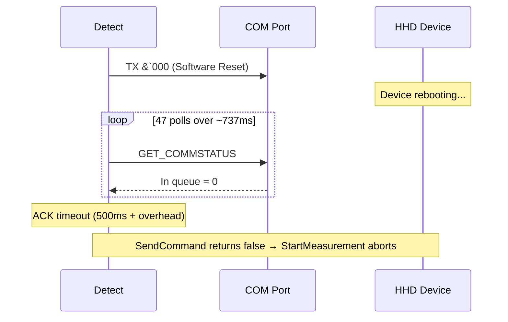
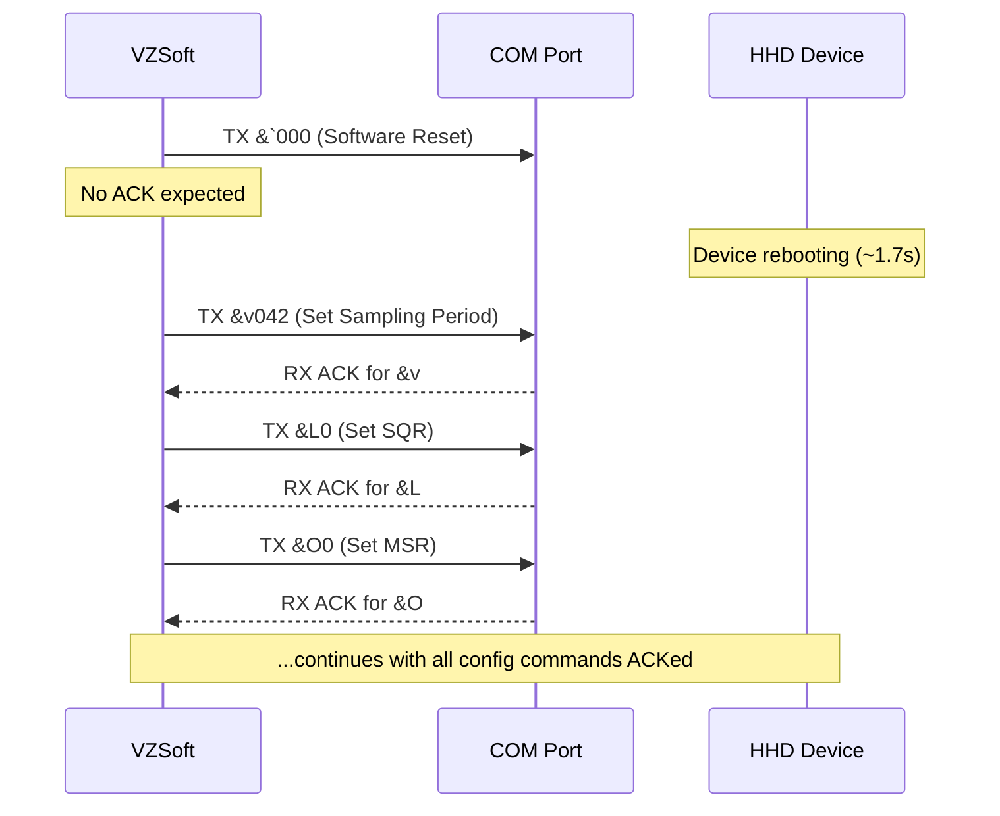
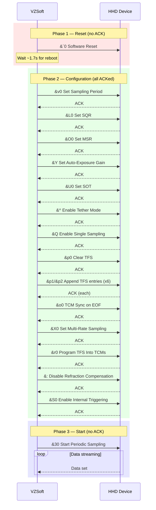
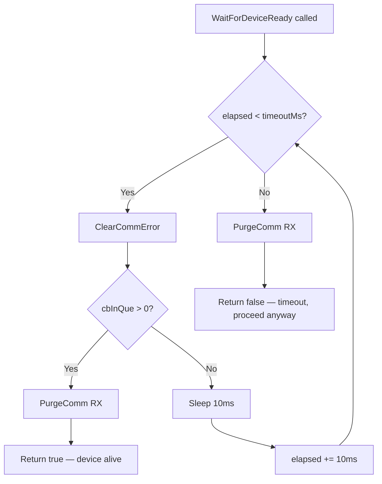
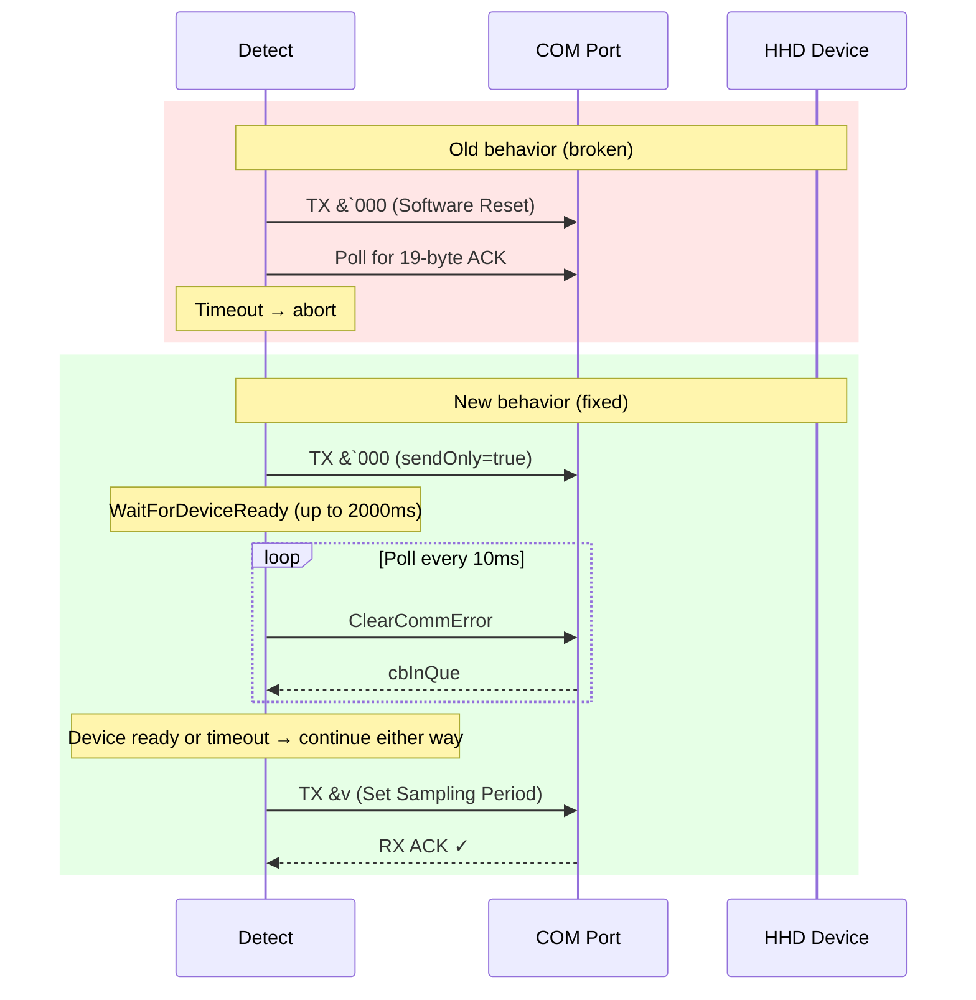

# Measurement Failure Analysis

## Capture Comparison: VZSoft vs Detect

| Metric | VZSoft | Detect (before fix) | Detect (after fix) |
|---|---|---|---|
| dmslog8 size | 1,652,736 bytes | 97,316 bytes | 163,520 bytes |
| txt trace lines | 153,674 | 2,343 | 8,626 |
| Total frames (JSON) | 95 | 2 | 644 |
| TX commands | 22 | 1 | 23 |
| RX ACK messages | 18 | 0 | 21 |
| RX data sets | 55 | 1 (garbage) | 600 |

The VZSoft capture ran at 1 Hz with 5 markers for ~10s (55 data sets).
The fixed Detect capture ran at 10 Hz with 6 markers for ~10s (600 data sets).
Both sessions completed successfully with all configuration commands ACKed.

## Root Cause

**The `&`` (Software Reset) command does not generate an ACK, but the Detect code waited for one.**

In `Measure_HHD.cpp:224-229` (before fix):

```cpp
// 1. Status/version query: &` 000           <-- misleading comment: this is a Software Reset
auto cmdStatus = BuildCommand('`', '0', '0', '0');
if (!SendCommand(hPort, cmdStatus))           <-- sendOnly defaults to false; waits for 19-byte ACK
{
    std::cerr << "  [Measure] Status query failed" << std::endl;
    return nullptr;                            <-- aborts entire measurement sequence
}
```

`SendCommand()` with `sendOnly=false` polls `ClearCommError` for 500ms waiting for >= 19 bytes in the RX queue. The device is rebooting and cannot respond. The poll loop exhausts, prints "ACK timeout for command 0x60", and `StartMeasurement` returns `nullptr`.

### Evidence from the Detect IRP trace (before fix)

The Detect trace confirms the exact failure path:



1. **50.286565s** -- Write `26 60 30 30 30 0d` (`&`000\r`, Software Reset)
2. **50.286621s - 51.023390s** -- 47 consecutive `GET_COMMSTATUS` polls, all returning `In queue = 0`
3. **No ACK ever arrives** -- the trace ends with continuous zero-byte polls

The polling spans ~737ms (500ms ACK timeout + ReadTotalTimeoutConstant overhead), after which `SendCommand` returns `false` and the measurement is aborted at the very first command.

### Evidence from the VZSoft IRP trace

VZSoft handles the Software Reset completely differently:



1. **05.027206s** -- TX `&`000` (Software Reset) -- **no ACK expected or received**
2. **06.732695s** -- TX `&v042` (Set Sampling Period) -- **1.705 seconds later**
3. **06.748556s** -- RX ACK for `&v` -- first ACK in the entire session

VZSoft sends the reset as fire-and-forget, waits ~1.7 seconds for the device to reboot, then proceeds with configuration commands that DO generate ACKs.

## Full VZSoft Command Sequence (from JSON)



**Key insight:** Only two commands produce no ACK: Software Reset (`&``) and Start (`&3`). The Detect code correctly uses `sendOnly=true` for `&3` (line 339) but incorrectly waited for an ACK on `&``.

## Applied Fix

Three changes to the measurement module:

### 1. `Measure_HHD.h` -- New `resetTimeoutMs` parameter

```cpp
HHD_MeasurementSession *StartMeasurement(HANDLE hPort, int frequencyHz,
    const std::vector<HHD_MarkerEntry> &markers, int resetTimeoutMs = 2000);
```

### 2. `Measure_HHD.cpp` -- New `WaitForDeviceReady` helper



```cpp
bool WaitForDeviceReady(HANDLE hPort, int timeoutMs)
{
    DWORD   errors  = 0;
    COMSTAT comstat = {};
    int     elapsed = 0;
    while (elapsed < timeoutMs)
    {
        ClearCommError(hPort, &errors, &comstat);
        if (comstat.cbInQue > 0)
        {
            PurgeComm(hPort, PURGE_RXCLEAR);
            return true;   // device is alive -- proceed immediately
        }
        Sleep(RESET_POLL_MS);
        elapsed += RESET_POLL_MS;
    }
    PurgeComm(hPort, PURGE_RXCLEAR);
    return false;  // timeout -- proceed anyway
}
```

Polls the RX queue every 10ms. Returns early as soon as the device sends any data (indicating it has rebooted), or proceeds after the timeout expires. Drains received data in either case.

### 3. `Measure_HHD.cpp` -- Software Reset with `sendOnly=true`



```cpp
auto cmdReset = BuildCommand('`', '0', '0', '0');
if (!SendCommand(hPort, cmdReset, /*sendOnly=*/true))
    ...
WaitForDeviceReady(hPort, resetTimeoutMs);
```

Sends the reset without waiting for an ACK, then uses the polling wait instead of a blind `Sleep`.

### Result

The fix is confirmed working. The Detect capture after the fix shows:
- All 21 configuration commands sent and ACKed correctly
- 600 data sets received (10 Hz x 6 markers x 10 seconds)
- Complete measurement cycle including clean stop
