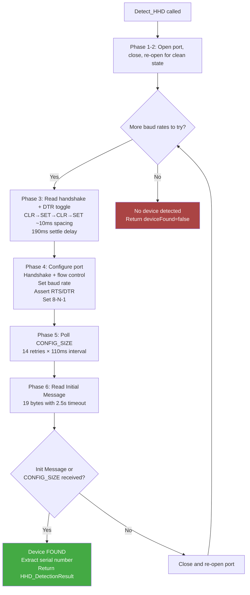
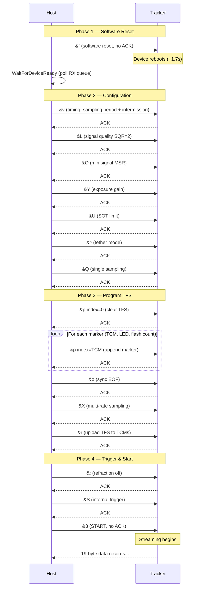
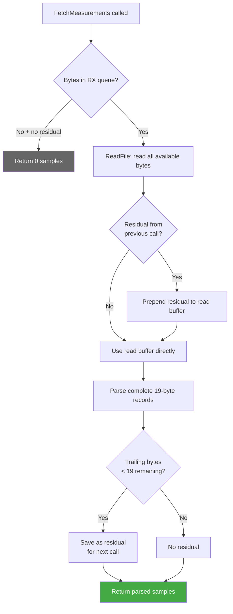
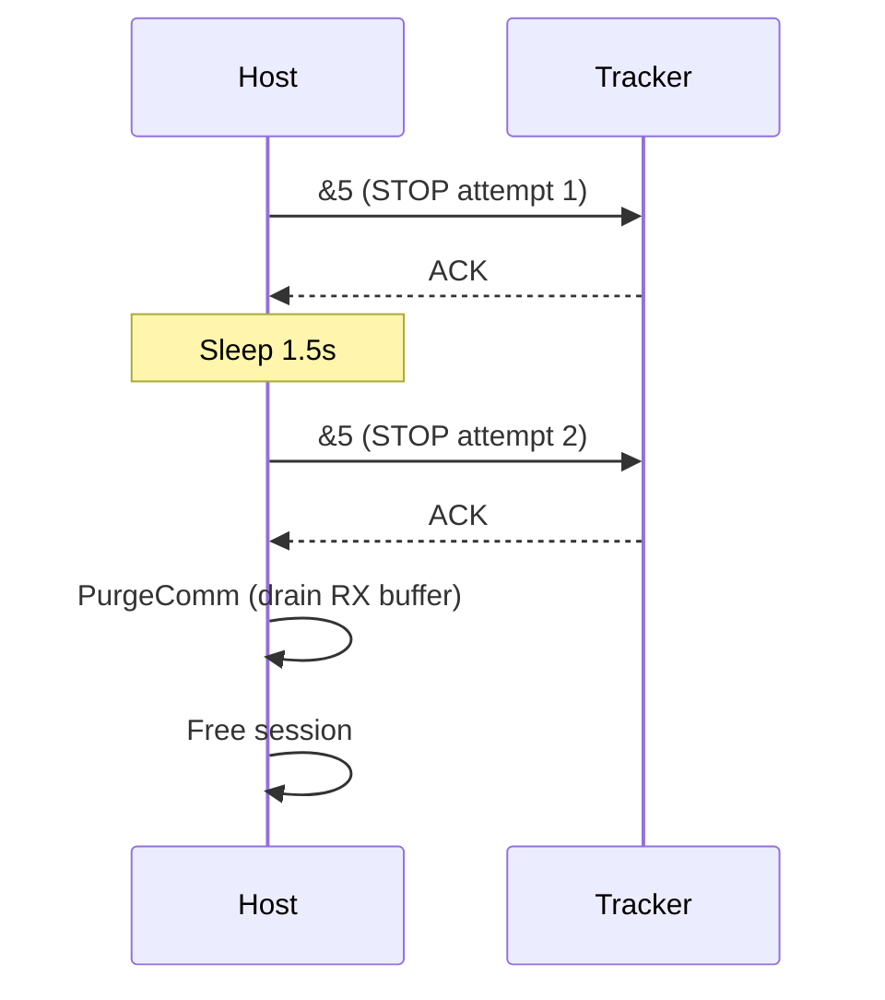

# Phoenix

Low-level driver and tooling for the **Phoenix Technologies Visualeyez VZ10K/VZ10K5** 3D optical tracker, communicating over RS-422 serial at up to 2.5 Mbps.

## Solution structure

The Visual Studio solution (`Phoenix.slnx`) contains two projects:

### Detect

Interactive console application for tracker detection and real-time 3D measurement.

- **Device detection** — Scans COM1-COM16 using the full IRP-level handshake sequence (DTR toggle, baud negotiation at 2.0/2.5 Mbps, CONFIG_SIZE polling) reverse-engineered from HHD Device Monitoring Studio captures.
- **Measurement** — Configures the Target Flashing Sequence (TFS), starts periodic sampling, and streams live 3D coordinates (X/Y/Z in mm, timestamp, LED/TCM IDs) to the console.
- **Interactive controls** — `h` detect, `s` start measurement, `t` stop, `q` quit (saves settings to `Settings/Detect.json`).
- **Log conversion** — When invoked with a directory argument, batch-converts `.dmslog8` captures to decoded JSON.

### ConvertToJson

Standalone command-line tool that converts HHD Device Monitoring Studio `.dmslog8` log files into human-readable JSON.

- Parses IRP-level serial records (TX/RX separation, timestamps).
- Decodes the full Phoenix VZK10 protocol: commands, 3D data sets, ACK/ERR messages, and initialization messages.
- Supports single-file and recursive directory conversion.

## Requirements

- **OS:** Windows (Win32 API for serial I/O and `DeviceIoControl` IOCTLs)
- **Compiler:** Visual Studio 2022+ (MSVC), C++17
- **Hardware:** Phoenix Visualeyez VZ10K or VZ10K5 tracker connected via RS-422/USB adapter

## Building

Open `Phoenix.slnx` in Visual Studio and build the solution (x64/Release or Debug).

## Usage

### Detect (interactive mode)

```cmd
Detect.exe
```

Press `h` to scan for the tracker, then `s` to start a 10 Hz measurement session (auto-stops after 10 seconds).

### Detect (batch conversion)

```cmd
Detect.exe <directory>
```

Converts all `.dmslog8` files in the directory to `.json`.

### ConvertToJson

```cmd
ConvertToJson.exe <input.dmslog8> [output.json]
ConvertToJson.exe <directory>
```

## Protocol overview

| Detail | Value |
|---|---|
| Protocol | Phoenix Visualeyez VZK10 RS-422 |
| Baud rates | 2,500,000 / 2,000,000 |
| Frame format | 8-N-1 |
| Command format | `&<code><index><bytesPerParam><numParams>\r [params]` (6+ bytes) |
| Data record | 19 bytes: 4-byte timestamp + 3x 3-byte coords + 4-byte status + LED ID + TCM ID |
| Init message | `01 02 03 04` + 8-byte serial number + reserved + check bytes |

See `Doc/Cheat sheet.md` for the full command reference and `Doc/runloop.md` for the measurement run-loop design.

## Documentation

The `Doc/` folder contains protocol analysis, architecture notes, and vendor manuals:

- `Cheat sheet.md` — Command reference for the VZ10K low-level protocol
- `runloop.md` — Measurement run-loop design and state machine
- `MeasureFailure.md` — Failure analysis with Mermaid sequence diagrams
- `Detect analysis Gemini.md` — Detection sequence analysis
- Vendor PDFs: Online User Manual, Quick Start Guide, VZDaq Manual, PTI Low Level Control Kit

## Detect project — Function reference

### Public API

| Function | File | Description |
|---|---|---|
| `Detect_HHD(portName)` | `Detect_HHD.cpp` | Full IRP-level detection sequence on a single COM port. Tries 2.0 and 2.5 Mbaud, returns `HHD_DetectionResult` with serial number and baud rate. |
| `StartMeasurement(hPort, frequencyHz, markers, resetTimeoutMs)` | `Measure_HHD.cpp` | Sends the complete configuration command sequence and starts periodic sampling. Returns an opaque `HHD_MeasurementSession*`. |
| `FetchMeasurements(session, samples)` | `Measure_HHD.cpp` | Non-blocking read of available 19-byte data records from the serial buffer. Parses complete records, buffers partial residuals for the next call. |
| `StopMeasurement(session)` | `Measure_HHD.cpp` | Sends `&5` (STOP) twice with a 1.5 s gap, drains the RX buffer, and frees the session. |

### Interactive console (main.cpp)

| Function | Description |
|---|---|
| `main(argc, argv)` | Entry point — interactive console (no args) or batch `.dmslog8` conversion (directory arg). |
| `CheckPort(portNum)` | Quick-check a COM port for the `01 02 03 04` init message at 2.5 Mbaud. Returns an open `HANDLE` on success. |
| `PingDevice(hSerial)` | Sends `&7` (Ping) and validates the ACK echo. |
| `convertFile(inputPath, outputPath)` | Converts a single `.dmslog8` file to decoded JSON using `DmsLogReader` + `PhoenixDecoder` + `JsonWriter`. |
| `convertDirectory(dirPath)` | Recursively finds all `.dmslog8` files in a directory and batch-converts them. |
| `BytesToHex(bytes)` | Formats a byte vector as a continuous hex string. |
| `BytesToString(bytes)` | Formats a byte vector as printable ASCII (non-printable bytes become `.`). |
| `GenerateLogFilename()` | Returns `Output/Measure_YYYYMMDD_HHMM.ndjson` based on the current system time. |
| `WriteFrameNdjson(logFile, frameSamples)` | Writes one NDJSON line per frame: `frame` group + `markers` array with position and quality per marker. |

### Detection internals (Detect_HHD.cpp, anonymous namespace)

| Function | Description |
|---|---|
| `OpenPort(portPath)` | Opens a COM port with `GENERIC_READ\|WRITE`, exclusive access. |
| `ToggleDTR(hPort)` | DTR line toggle sequence (`CLR→SET→CLR→SET`, ~10 ms spacing + 190 ms settle) to trigger a hardware reset. |
| `ConfigureHandshake(hPort, xonLimit)` | Sets `ControlHandShake=0x2D`, `FlowReplace=0x01`, and the specified `XonLim`. |
| `QueryPortStatus(hPort)` | Reads modem status, comm errors, and comm properties (informational, matching IRP capture). |
| `SetBaudRate(hPort, baudRate)` | Sets the baud rate via `SetCommState`. |
| `SetLineControl8N1(hPort)` | Configures 8 data bits, 1 stop bit, no parity. |
| `QueryDtrRts(hPort)` | Reads DTR/RTS state via `IOCTL_SERIAL_GET_DTRRTS`. |
| `PollConfigSize(hPort, configSize)` | Polls `IOCTL_SERIAL_CONFIG_SIZE` up to 14 times at ~110 ms intervals. Non-zero return indicates device presence. |
| `ReadInitialMessage(hPort, serialNumber)` | Reads the 19-byte Initial Message (header `01 02 03 04` + 8-byte serial + status `01` + trailer `10 11 12 13`). |
| `RunDetectionPass(hPort, pass, configSize, serialNumber)` | Orchestrates Phases 3–6 for a single baud-rate pass. |

### Measurement internals (Measure_HHD.cpp, anonymous namespace)

**Command construction & I/O**

- `BuildCommand(code, index, ...)` — Constructs a 6+ byte PTI command buffer.
- `SendCommand(hPort, cmd, sendOnly)` — Sends a command and polls for the 19-byte ACK. Pass `sendOnly=true` for commands that produce no ACK (`&3` START, `` &` `` RESET).

**Byte encoding**

- `EncodeBE32(out, val)` — Encode uint32 as 4 bytes, big-endian.
- `DecodeBE32(buf)` — Decode 4 bytes as uint32, big-endian.
- `DecodeBE24Signed(buf)` — Decode 3 bytes as signed 24-bit (X/Y/Z coords, units of 0.01 mm).

**Record parsing & device readiness**

- `ParseRecord(rec)` — Parses one 19-byte data record into `HHD_MeasurementSample`.
- `WaitForDeviceReady(hPort, timeoutMs)` — Polls the RX queue after a software reset; returns early when data arrives.

## Deep dive

### Detection sequence (Detect_HHD)

`Detect_HHD` replicates the exact IRP-level serial I/O traffic captured from the reference application using HHD Device Monitoring Studio. The detection runs two passes (2.0 Mbaud, then 2.5 Mbaud), each executing Phases 3–6.



The **Initial Message** is the definitive confirmation of tracker presence (PTI manual Section 4.5, page 20):

```
Byte:  1  2  3  4  5───────────12  13 14  15  16 17 18 19
       01 02 03 04 [Serial Number]  rsvd 01  10 11 12 13
       ╰─ header ─╯                     ╰init╯╰─trailer─╯
```

### Measurement cycle (Start → Run → Stop)

A measurement session follows three phases: configuration, streaming, and shutdown.

#### Start (`StartMeasurement`)

Sends 15 commands in sequence, each waiting for a 19-byte ACK (except reset and start which produce no ACK):



#### Run (`FetchMeasurements`)

Once streaming, `FetchMeasurements` is called in a non-blocking run loop:



Each 19-byte data record decodes to:

| Bytes | Field | Encoding |
|---|---|---|
| 1–4 | Timestamp | Big-endian uint32, microseconds since boot |
| 5–7 | X coordinate | Big-endian signed 24-bit, ÷100 → mm |
| 8–10 | Y coordinate | Big-endian signed 24-bit, ÷100 → mm |
| 11–13 | Z coordinate | Big-endian signed 24-bit, ÷100 → mm |
| 14–17 | Status word | See decoded fields below |
| 18 | LED ID | Bits 6–0 (1–64) |
| 19 | TCM ID | Bits 3–0 (1–8) |

The status word (bytes 14–17) is decoded into per-lens signal quality:

| Byte | Bits | Field | Description |
|---|---|---|---|
| 14 | `E\|HHH\|mmmm` | endOfFrame, coordStatus, ambientLight | Frame boundary, coord error (0=OK), ambient light (0–15) |
| 15 | `???\|La\|AAAA` | rightEyeSignal, rightEyeStatus | Right lens: signal low flag + status (0=no anomaly) |
| 16 | `TTT\|Lb\|BBBB` | triggerIndex(hi), centerEyeSignal, centerEyeStatus | Center lens + trigger index high 3 bits |
| 17 | `TTT\|Lc\|CCCC` | triggerIndex(lo), leftEyeSignal, leftEyeStatus | Left lens + trigger index low 3 bits |

#### NDJSON frame logging

During measurement, each complete frame (ending with `endOfFrame=true`) is written as one line to an NDJSON file in `./Output/`. The filename is generated from the current date/time: `Measure_YYYYMMDD_HHMM.ndjson`.

Each line contains:

```json
{
  "frame": { "timestamp_us": 30079432, "markerCount": 6, "triggerIndex": 1 },
  "markers": [
    {
      "tcmId": 1, "ledId": 1,
      "position": { "x": -0.01, "y": 16770.56, "z": -0.01 },
      "quality": {
        "ambientLight": 3, "coordStatus": 0,
        "rightEye":  { "signal": 0, "status": 6 },
        "centerEye": { "signal": 0, "status": 4 },
        "leftEye":   { "signal": 0, "status": 0 }
      }
    }
  ]
}
```

| Field | Description |
|---|---|
| `frame.timestamp_us` | Timestamp of the first marker in the frame (μs since boot) |
| `frame.markerCount` | Number of markers in this frame |
| `frame.triggerIndex` | 6-bit trigger index from the status word |
| `markers[].position` | X/Y/Z coordinates in millimeters |
| `markers[].quality` | Per-lens signal quality: ambient light, coord status, and right/center/left eye signal + status |

#### Stop (`StopMeasurement`)


